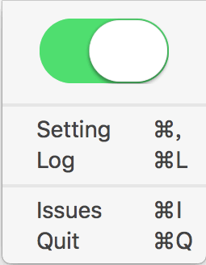
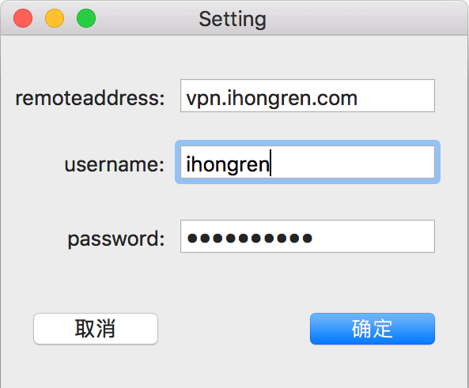
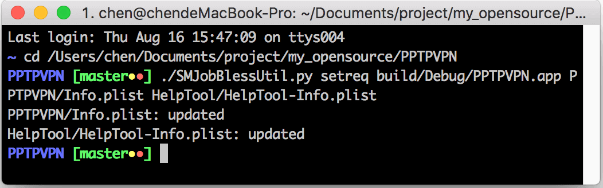

# pptp-vpn
pptp vpn client for macos

**PPTPVPN** 是MacOS上的pptp vpn客户端。


**截图（Screenshots）**

---






#### Build & run

**General**

- Team 设置为你自己的

- Signing Certificate 设置为 Mac Developer

  

**Build**

1. 先简单编译一遍.

2. 打开终端，切换到本工程**SMJobBlessUtil.py**文件所在目录，并执行脚本：

   ```shell
   $ ./SMJobBlessUtil.py setreq build/Debug/PPTPVPN.app PPTPVPN/Info.plist HelpTool/HelpTool-Info.plist
   
   //如果成功，则显示
   PPTPVPN/Info.plist: updated
   HelpTool/HelpTool-Info.plist: updated
   ```

   如图：

   

   如果以上过程中出错请移步**苹果官方Demo**[SMJobBless ReadMe.txt](https://developer.apple.com/library/archive/samplecode/SMJobBless/Listings/ReadMe_txt.html#//apple_ref/doc/uid/DTS40010071-ReadMe_txt-DontLinkElementID_3) (Safari打开).


#### 参考:

[Apple SMJobBless](https://developer.apple.com/library/archive/samplecode/SMJobBless/Introduction/Intro.html)

[Apple EvenBetterAuthorizationSample](https://developer.apple.com/library/archive/samplecode/EvenBetterAuthorizationSample/Introduction/Intro.html)

[lex-integrity-mac](https://github.com/davidjosefson/lex-integrity-mac) 

[Execute a terminal command from a Cocoa app](https://stackoverflow.com/questions/412562/execute-a-terminal-command-from-a-cocoa-app/412573#412573)

 [AlonsoZhang/PPTP](https://github.com/AlonsoZhang/PPTP)